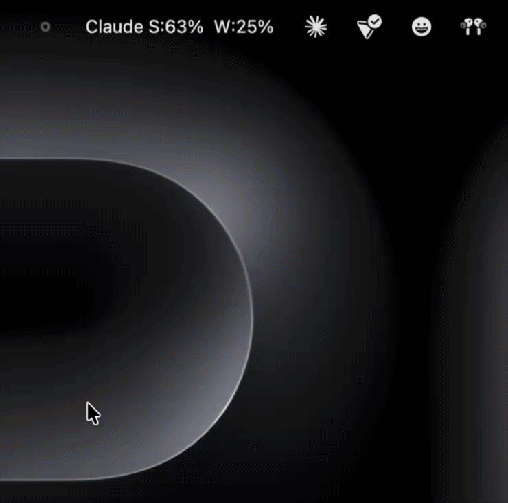
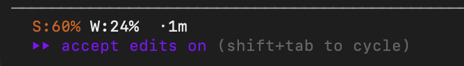

# ClaudeWatch

A minimal macOS menu bar app that shows your Claude session and weekly usage in real time — no browser tab required after setup.



```
Claude S:71%  W:14%
  ┌─────────────────────────────────┐
  │ Session:  █│█│█│█│█│▒│▒│▒  71% │
  │   ↺ resets  in 6 min           │
  │   ▁▂▃▄▅▆▇▇██  ↑ +15%          │
  │                                 │
  │ Weekly:   █│▒│▒│▒│▒│▒│▒│▒  14% │
  │   ↺ resets  Thu 12:00 AM       │
  │   ▁▁▁▁▂▂▂▂▃▃  → steady        │
  │                                 │
  │ Last updated:  Apr 30 14:22    │
  │                                 │
  │ Open Settings                  │
  │ Quit                           │
  └─────────────────────────────────┘
```

**S** = current session · **W** = weekly across all models

---

## Installation

```bash
git clone https://github.com/Alex-duh/claude-usage-tracker.git
cd claude-usage-tracker
```

---

## How it works

Two pieces work together:

**Chrome extension** — runs silently in the background, opens `claude.ai/settings/usage` every 3 minutes, scrapes your usage numbers, and sends them to your Mac over a local HTTP connection (never leaves your machine).

**Menu bar app** — a Python app that listens for that data and keeps your menu bar up to date. Saves every reading to a local history log so it can show sparkline graphs and trends over time.

```
claude.ai/settings/usage
        │
   content.js  (reads the page)
        │
   POST :9999  (localhost only)
        │
   Flask server  ──▶  rumps menu bar
                            │
                   ~/.claude_usage.json          (current state)
                   ~/.claude_usage_history.json  (rolling history)
```

---

## Features

### Live progress bars
Both session and weekly usage shown as solid block bars — white filled, grey remaining — that adapt automatically to light and dark mode.

### Sparkline history graphs
Every scrape is logged locally. The dropdown shows a mini graph of the last ~45 minutes of readings so you can see usage trajectory at a glance. Toggle it on or off with the **Graph** button in the menu.

```
▁▂▃▄▅▆▇▇██  ↑ +15%
```

### Trend indicators
Compares current usage to ~1 hour ago and shows whether you're accelerating, steady, or if a session reset was detected.

| Indicator | Meaning |
|---|---|
| `↑ +15%` | Used 15% more than an hour ago |
| `→ steady` | Usage rate is flat |
| `↓ -5%` | Less usage than an hour ago |
| `↺ reset` | Session reset detected |

### Claude Code statusline
Usage is shown directly in the Claude Code terminal UI — session in Anthropic orange, weekly in white, with a live staleness indicator.



```
◆ Claude  S:71% W:14% ·now
```

### Zero credential risk
ClaudeWatch reads the `claude.ai/settings/usage` page the same way a human would — no session keys, no API tokens, no cookies extracted. Other tools in this space pull `sk-ant-` session keys from your browser, which carries real account risk. ClaudeWatch never touches your credentials.

### Persists across restarts
Last known values are restored immediately on launch from `~/.claude_usage.json`, so the menu bar always shows real numbers — even before the first scrape of a new session.

---

## Requirements

- macOS 12 or later
- Python 3.9 or later (`python3 --version` to check)
- Google Chrome
- Claude paid account (Pro, Team, or Max)

---

## Setup

### Part 1 — Menu bar app (one-time install)

Installs the app as a **login item** — starts automatically at every login, no terminal needed after this.

```bash
cd menubar
bash install.sh
```

`Claude —` appears in your menu bar within a few seconds. After the next reboot it starts on its own.

> **To stop:** Click **Quit** in the menu bar dropdown.
>
> **To reopen after quitting:** just type `cw` in any terminal — the alias is installed automatically by `install.sh`.
>
> **Manual restart (if needed):**
> ```bash
> launchctl load ~/Library/LaunchAgents/com.claudetracker.menubar.plist
> ```

### Part 2 — Chrome extension

1. Open Chrome → `chrome://extensions`
2. Enable **Developer mode** (toggle, top right)
3. Click **Load unpacked** → select the `extension/` folder
4. Navigate to `claude.ai/settings/usage` once to trigger the first scrape

### Part 3 — Claude Code statusline (optional)

Usage is already wired into Claude Code's statusline. The script at `menubar/statusline.sh` reads from the same local JSON file the menu bar app writes, so no extra setup is needed — just make sure the menu bar app is running.

---

## How updates work

| Trigger | When |
|---|---|
| You visit `claude.ai/settings/usage` | Instantly on page load |
| Background auto-refresh | Every 3 minutes (silent background tab) |
| SPA navigation within claude.ai | Detected automatically |

---

## Comparison

|  | ClaudeWatch | ClaudeMeter | Claude-Usage-Tracker |
|---|---|---|---|
| Language | Python + JS | Swift | Swift |
| macOS requirement | 12+ | 14+ (Sonoma) | 14+ (Sonoma) |
| Install | `bash install.sh` | Xcode or unsigned .dmg | Xcode or unsigned .dmg |
| Credential access | None | Extracts session key | Extracts session key + API key |
| ToS risk | None | Flagged in their own README | Sends anonymous analytics |
| Usage history + trends | ✓ | ✗ | ✗ |
| Claude Code statusline | ✓ | ✗ | ✓ |
| Adaptive dark / light mode | ✓ | ✓ | ✓ |

---

## Files

```
ClaudeWatch/
├── extension/
│   ├── manifest.json              # Chrome MV3 manifest
│   ├── content.js                 # Scrapes settings page, POSTs to Flask
│   └── background.js              # Opens/reloads settings tab every 3 min
│
├── menubar/
│   ├── app.py                     # Flask server + rumps menu bar app
│   ├── statusline.sh              # Claude Code statusline script
│   ├── requirements.txt           # rumps, flask
│   ├── install.sh                 # One-time setup + login item registration
│   ├── start.sh                   # Manual launch for dev/testing
│   └── com.claudetracker.menubar.plist  # launchd config
│
├── .gitignore
└── README.md
```

---

## Troubleshooting

**Menu bar shows `Claude —`**
→ Visit `claude.ai/settings/usage` to trigger the first scrape.

**`[ClaudeWatch] Server unreachable` in Chrome DevTools**
→ The menu bar app isn't running: `launchctl load ~/Library/LaunchAgents/com.claudetracker.menubar.plist`

**Port 9999 already in use**
```bash
lsof -ti:9999 | xargs kill -9
launchctl load ~/Library/LaunchAgents/com.claudetracker.menubar.plist
```

**Sparkline shows `no history yet`**
→ Normal on first launch. It populates after a few scrapes.

**Scraper breaks after a Claude UI update**
→ Update the regex patterns in `extension/content.js` → `parseUsage()`. The `[ClaudeTracker]` logs in Chrome DevTools show exactly what text the script found.

**Checking logs**
```bash
tail -f /tmp/claudetracker.log
tail -f /tmp/claudetracker.err
```

---

## License

MIT © 2025 Alex Du

Permission is hereby granted, free of charge, to any person obtaining a copy of this software and associated documentation files (the "Software"), to deal in the Software without restriction, including without limitation the rights to use, copy, modify, merge, publish, distribute, sublicense, and/or sell copies of the Software, and to permit persons to whom the Software is furnished to do so, subject to the following conditions:

The above copyright notice and this permission notice shall be included in all copies or substantial portions of the Software.

THE SOFTWARE IS PROVIDED "AS IS", WITHOUT WARRANTY OF ANY KIND, EXPRESS OR IMPLIED, INCLUDING BUT NOT LIMITED TO THE WARRANTIES OF MERCHANTABILITY, FITNESS FOR A PARTICULAR PURPOSE AND NONINFRINGEMENT. IN NO EVENT SHALL THE AUTHORS OR COPYRIGHT HOLDERS BE LIABLE FOR ANY CLAIM, DAMAGES OR OTHER LIABILITY, WHETHER IN AN ACTION OF CONTRACT, TORT OR OTHERWISE, ARISING FROM, OUT OF OR IN CONNECTION WITH THE SOFTWARE OR THE USE OR OTHER DEALINGS IN THE SOFTWARE.
